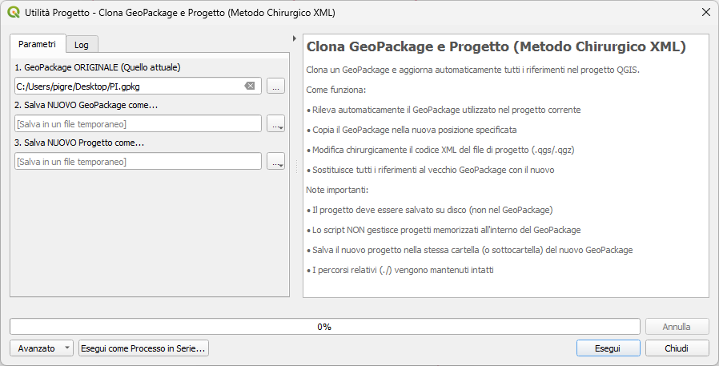

# Clona GeoPackage e Progetto (Metodo Chirurgico XML)

Script QGIS Processing per duplicare un GeoPackage e aggiornare automaticamente i riferimenti nel progetto QGIS utilizzando la modifica diretta del codice XML.

> ⚠️ **DISCLAIMER**: Questo algoritmo è ancora in fase di testing. Si consiglia di effettuare backup dei propri progetti e GeoPackage prima dell'utilizzo. Verificare sempre il risultato dopo l'esecuzione.

## 📋 Descrizione

Questo script ignora le impostazioni di QGIS e modifica direttamente il codice XML del file di progetto. Sostituisce il nome del file GeoPackage vecchio con quello nuovo ovunque lo trovi (anche nei percorsi relativi `./`).

## ✨ Caratteristiche

- Rilevamento automatico del GeoPackage utilizzato nel progetto corrente
- Verifica che il progetto corrente non sia salvato dentro un GeoPackage
- Copia un GeoPackage esistente in una nuova posizione
- Modifica chirurgicamente il file di progetto QGIS (`.qgs` o `.qgz`)
- Sostituisce tutti i riferimenti al vecchio GeoPackage con il nuovo
- Supporta sia progetti compressi (`.qgz`) che non compressi (`.qgs`)
- Mantiene percorsi relativi intatti

## 🚀 Utilizzo

1. Apri il tuo progetto QGIS che usa il GeoPackage da duplicare
2. **Salva il progetto su disco** (importante: NON dentro un GeoPackage, ma come file .qgs/.qgz)
3. Esegui lo script tramite la Processing Toolbox
4. Fornisci i seguenti parametri:
   - **GeoPackage ORIGINALE**: Il file `.gpkg` attuale (viene precompilato automaticamente)
   - **Salva NUOVO GeoPackage come**: Il percorso e nome del nuovo file `.gpkg`
   - **Salva NUOVO Progetto come**: Il percorso e nome del nuovo progetto (`.qgs` o `.qgz`)

### Screenshot dell'interfaccia

## ⚠️ Note Importanti

- **Il progetto deve essere salvato su disco (non nel GeoPackage)** - Se il progetto corrente è dentro un GeoPackage, lo script si blocca e ti chiede di salvarlo su disco prima
- **Il nuovo progetto deve essere nella stessa cartella del nuovo GeoPackage** - Lo script verifica questo requisito e blocca l'esecuzione se non rispettato
- Lo script conta e riporta quante occorrenze del vecchio nome file sono state trovate e sostituite
- Dopo l'esecuzione, apri manualmente il nuovo progetto per verificare che tutto funzioni correttamente
- **Effettua sempre backup** dei tuoi progetti e GeoPackage prima di utilizzare lo script

## 📦 Installazione

1. Copia il file `clona_gpkg_progetto.py` nella cartella degli script di QGIS:
   - Linux: `~/.local/share/QGIS/QGIS3/profiles/default/processing/scripts/`
   - Windows: `C:\Users\<username>\AppData\Roaming\QGIS\QGIS3\profiles\default\processing\scripts\`
   - macOS: `~/Library/Application Support/QGIS/QGIS3/profiles/default/processing/scripts/`

2. Riavvia QGIS o aggiorna gli script dalla Processing Toolbox

## 🔧 Requisiti

- QGIS 3.x
- Python 3.x (incluso con QGIS)

## 📝 Licenza

Vedi il file [LICENSE](LICENSE) per i dettagli.

## 📜 Changelog

Tutte le modifiche significative sono documentate nel [CHANGELOG.md](CHANGELOG.md).

## 🤝 Contributi

Contributi, problemi e richieste di funzionalità sono benvenuti!

Per contribuire, consulta la [guida al contributo](CONTRIBUTING.md).

## 👤 Autore

**pigreco**

---

*Metodo Chirurgico XML - Modifica diretta del codice sorgente del progetto QGIS*